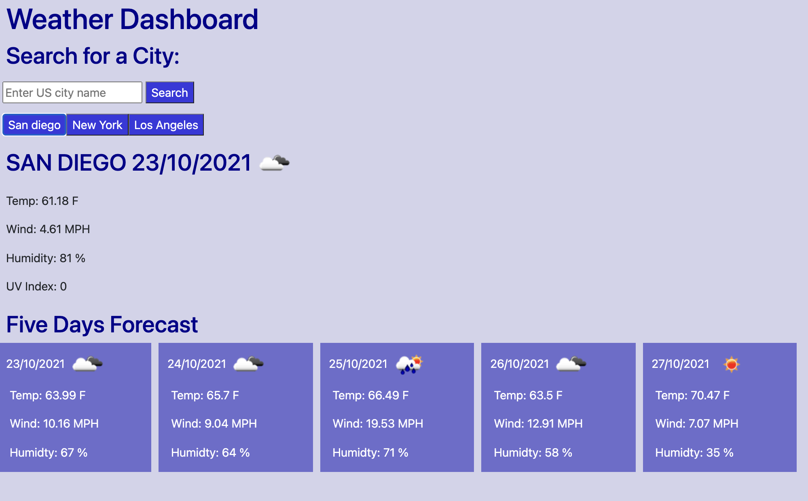

# weather-dashboard

# About
This application is designed to show the weather forecast of all the cities in the United States. When the user types the name of the city and click the search button, the forecast of that day and the the upcoming next five days pop up on the screen. All the data is called from openWeatherApi.

# Screenshot of the Deployed Application

# Link

[Link to the Deployed Application](https://hekmatsalehi.github.io/weather-dashboard/)
